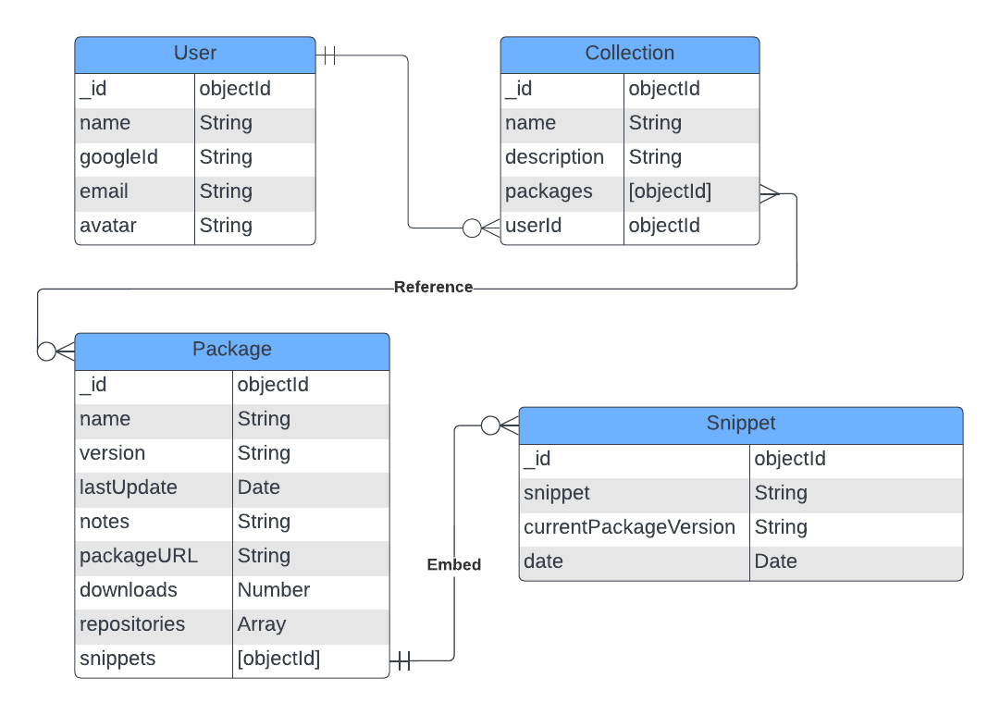
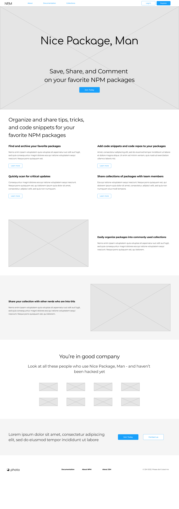
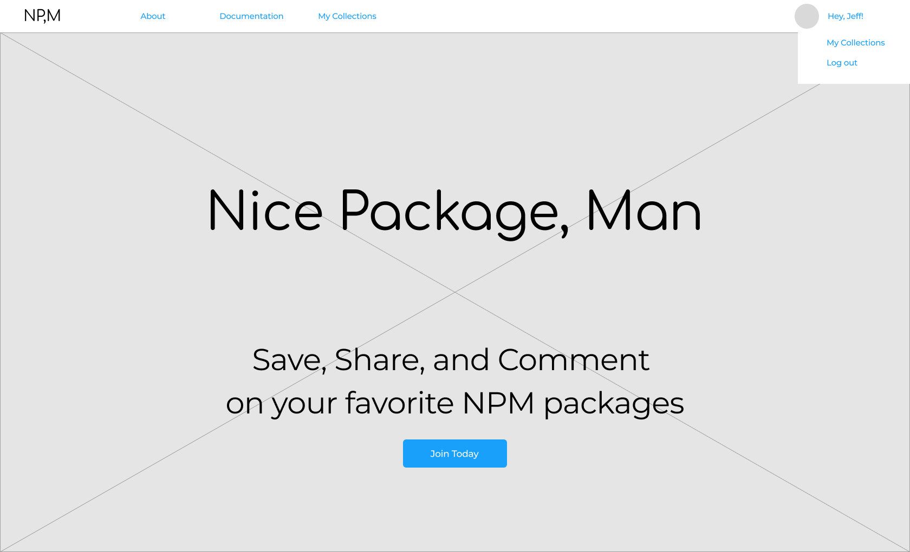
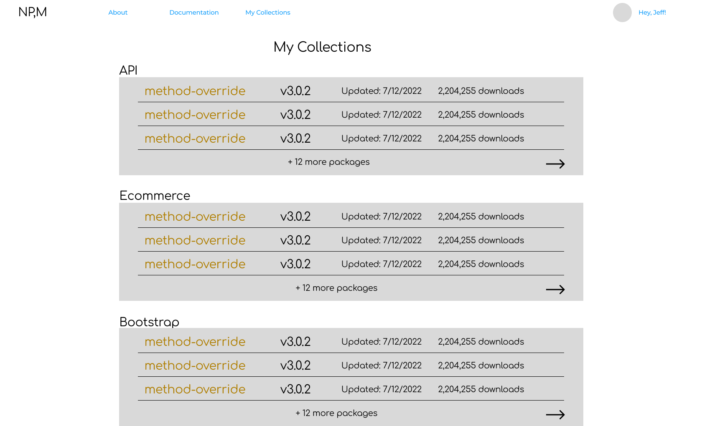
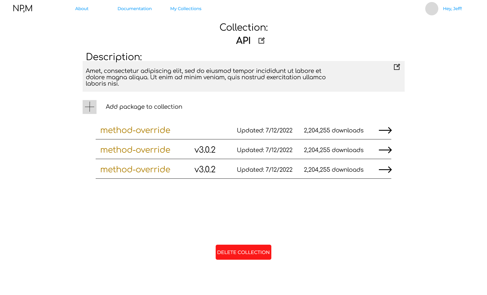
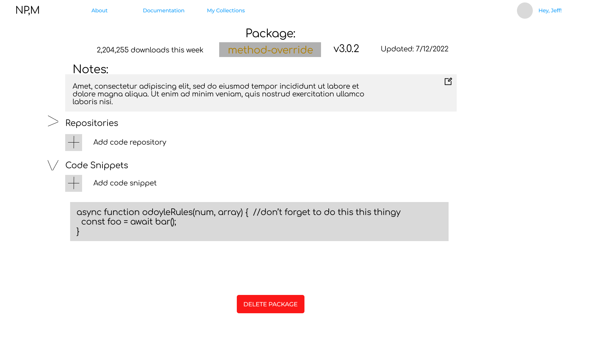

# Nice Package, Man

An easy way to keep track of and share some of the NPM packages that I've used in various applications. I wanted a way to keep track of these while also providing context around thier use - links to repos where I've used them, and some code snippets to help install, initiallize, and deloy them. Plus any other tips and tricks I maye have learned - links to stackoverflow, etc.

- <a href="https://trello.com/b/H21RGUZg/nice-package-man">Trello board</a>

ERD

ERD</a>

## Wireframes

Homepage - Logged Out

Homepage - Logged In

Collections View

Add Collections View

Package View

