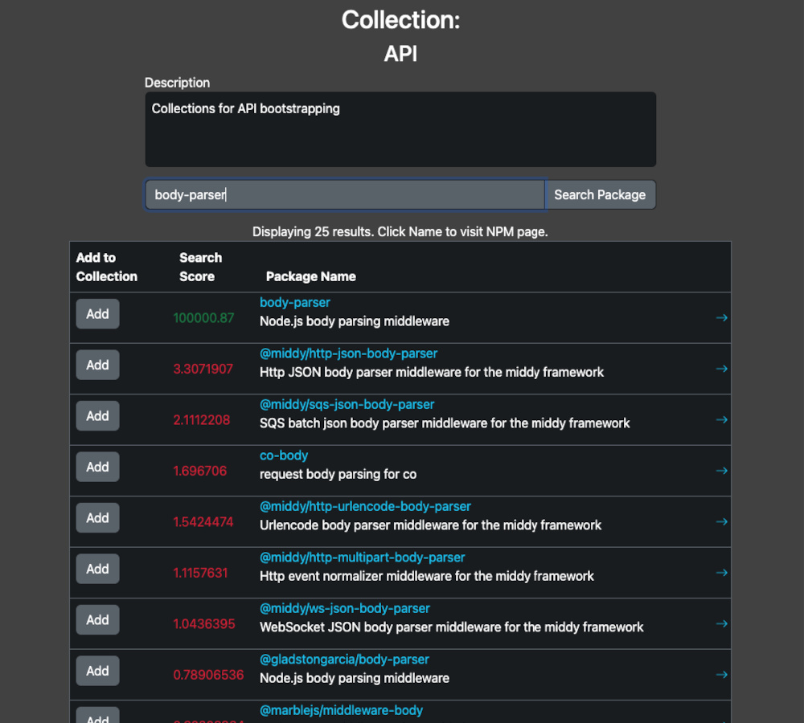
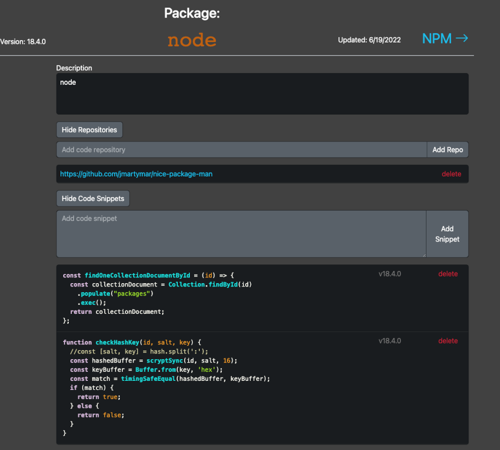
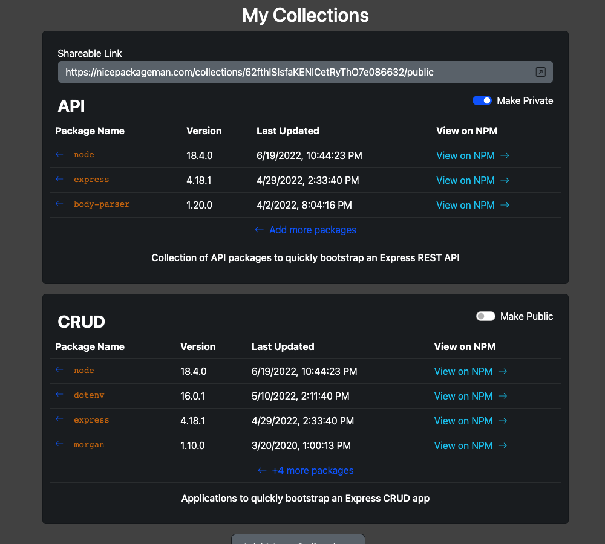
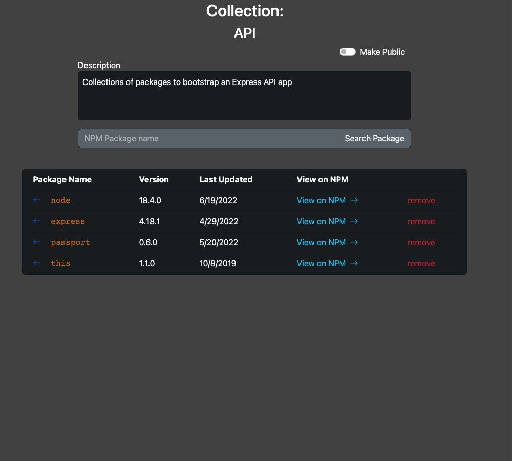

# Nice Package, Man

An easy way to keep track of and share some of the NPM packages that I've used in various applications. I wanted a way to keep track of these while also providing context around thier use - links to repos where I've used them, and some code snippets to help install, initiallize, and deloy them. Plus any other tips and tricks I maye have learned - links to stackoverflow, etc.

<a href="https://trello.com/b/H21RGUZg/nice-package-man">Trello board</a>

ERD

ERD</a>

## Wireframes

Homepage - Logged Out

Homepage - Logged In

Collections View

Add Collections View

Package View

## Screenshots

Package Search Using npmjs API

Package View

Collections View

Collection

## How to use

- Navigate to <a href="http://nice-package-man.herokuapp.com/" target="_blank">http://nice-package-man.herokuapp.com/</a>
- Login and authorize to create an account
- Navigate to Collections
- Create a new collection
- Search for packages to add to that collection
- Click on a package to view the package page
- Add Repository links and code snippets to that package

## Features

- Create multiple contextual collections of NPM packages
- Each package can be referenced in multiple collections
- Collections and PAckages can individually be set to private or public. Public links are viewable by anyone with the link.

## API

<a href="https://nice-package-man.herokuapp.com/api-docs" target="_blank">API Documentation</a>

- Create an API authorization key on the profile page
- Add your email address and the authorization key to the beginning of any endpoint request, seperated by a colon. ex.
  <pre>http://nice-package-man.herokuapp.com/api/{email}:{authorizationkey}/collections</pre>
- Only `GET` requests are available via the `/collections` and `/packages` endpoints

## Technologies

- Node.js
- Node Crypto for generating and checking authorization keys
- Swagger UI and Swagger JSDoc to build API documentation
- Express
- Passport for Oauth
- Bootstrap
